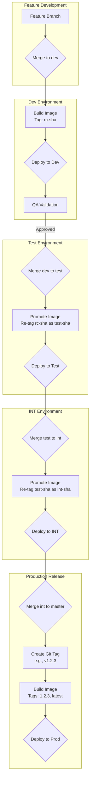

# Concept of Operations (CONOPS)

## 1. Overview

This document outlines the CI/CD workflow and image promotion strategy for applications built with SYAC. The core principle of this workflow is **Promote the Artifact, Not the Code**. This means a single, immutable Docker image is built once for a specific change and then promoted through successive environments. This strategy ensures that the exact artifact validated by QA is the same one deployed to production, minimizing risk and ensuring consistency.

## 2. Branching Strategy

The repository utilizes a GitFlow-like branching model to manage the flow of changes from development to production.

-   **Feature Branches (`feat-*`, `feature/*`, etc.):**
    -   All new development, bug fixes, and enhancements are done on feature branches.
    -   These are typically short-lived and are merged into the `dev` branch upon completion.

-   **`dev` Branch:**
    -   Serves as the primary integration branch for all new features.
    -   When code is merged into `dev`, it triggers a build of a release candidate image.
    -   This branch is deployed to the **Dev Environment** for initial integration testing and QA validation.

-   **`test` Branch:**
    -   Represents code that has been validated by QA in the dev environment.
    -   This branch is deployed to the **Test Environment**.
    -   Promotion to this branch is done by merging `dev` into `test`.

-   **`int` Branch:**
    -   Represents a collection of features that have passed testing and are staged for production release.
    -   This branch is deployed to the **Integration (INT) Environment** for final pre-production validation.
    -   Promotion to this branch is done by merging `test` into `int`.

-   **`master` Branch:**
    -   This is the production branch. It contains only code that has been fully tested and is ready for release.
    -   Code is promoted to `master` by merging the `int` branch.
    -   A merge to `master` is followed by the creation of a versioned Git tag, which triggers the final production build.

## 3. Image Tagging Strategy

SYAC uses an intelligent tagging strategy to identify and track images as they move through the pipeline.

-   **Release Candidate Tag (`rc-<sha>`):**
    -   Used for images built from the `dev` branch.
    -   Example: `myapp:rc-a1b2c3d`
    -   The short commit SHA provides a unique, traceable identifier for the exact code change that was built.

-   **Version Tag (`X.Y.Z`):**
    -   Used for production releases.
    -   Example: `myapp:1.2.3`
    -   This tag is created from a Git tag on the `master` branch.

-   **Latest Tag (`latest`):**
    -   A floating tag that always points to the most recent production release image.
    -   It is created and pushed alongside the version tag.

## 4. The Promotion Workflow

This section details the step-by-step process of moving a change from a feature branch to production.

### Step 1: Feature Development and Merge to `dev`

1.  A developer creates a feature branch and implements their changes.
2.  Once complete, they open a merge request to merge the feature branch into `dev`.
3.  Upon merging, the GitLab CI pipeline for the `dev` branch triggers.
4.  **Action:** `syac` builds a new Docker image.
5.  **Result:** The image is tagged `rc-<commit-sha>` and pushed to the container registry. It is then automatically deployed to the **Dev Environment**.

### Step 2: Promotion from `dev` to `test`

1.  The QA team validates the changes in the **Dev Environment**.
2.  Once approved, a merge request is opened to merge the `dev` branch into the `test` branch.
3.  Upon merging, the GitLab CI pipeline for the `test` branch triggers.
4.  **Action:** The pipeline **does not build a new image**. Instead, a promotion script runs.
5.  **Result:** The script identifies the `rc-<commit-sha>` image from the merge, re-tags it for the test environment, and pushes the new tag. The re-tagged image is then deployed to the **Test Environment**.

### Step 3: Promotion from `test` to `int`

1.  The process mirrors the promotion from dev to test.
2.  After validation in the **Test Environment**, the `test` branch is merged into the `int` branch.
3.  **Action:** The `int` branch pipeline re-tags the existing, validated image.
4.  **Result:** The re-tagged image is deployed to the **Integration (INT) Environment** for final, pre-production checks.

### Step 4: Release to Production

1.  When the `int` branch is stable and ready for release, it is merged into the `master` branch.
2.  Immediately following the merge, a release manager creates a new, versioned Git tag (e.g., `v1.2.3`) on the `master` branch.
3.  The creation of this new tag triggers the final production pipeline.
4.  **Action:** `syac` builds a new, clean image from the production code.
5.  **Result:** The image is tagged with both the version number (`1.2.3`) and `latest`. It is pushed to the registry and deployed to the **Production Environment**.
