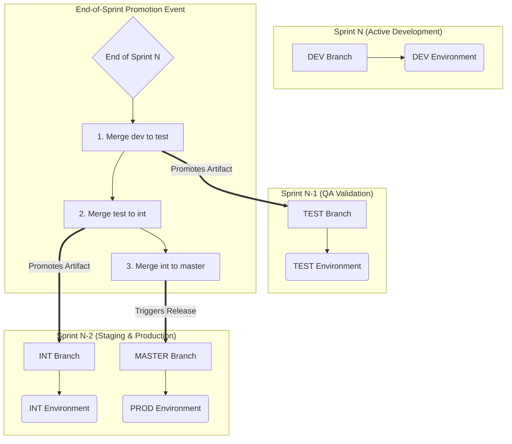

# Concept of Operations (CONOPS)

## 1. Overview

This document outlines the CI/CD workflow and image promotion strategy for applications built with SYAC. The workflow is based on a **sprint-centric promotion model**, where the entire body of work from a development sprint is promoted through environments as a single unit.

The core principle of this workflow is **Promote the Artifact, Not the Code**. A single, immutable Docker image is built once for a specific change and then promoted through successive environments. This strategy ensures that the exact artifact validated by QA is the same one deployed to production, minimizing risk and ensuring consistency.

## 2. Branching & Environment Strategy

The repository utilizes a GitFlow-like branching model that is aligned with a time-based, sprint-centric release cycle. Each primary branch corresponds to an environment and represents the code from a specific sprint.

-   **`dev` Branch (Sprint `N`):**
    -   Represents the **current, active sprint (`N`)**.
    -   Serves as the primary integration branch for all new features and bug fixes being developed in the current sprint.
    -   This branch is deployed to the **Dev Environment** for ongoing integration and developer testing.

-   **`test` Branch (Sprint `N-1`):**
    -   Represents the **previous, completed sprint (`N-1`)**.
    -   This branch is deployed to the **Test Environment**, where it is validated by the QA team throughout the current sprint.
    -   Code is moved here from the `dev` branch during the end-of-sprint promotion event.

-   **`int` Branch (Sprint `N-2`):**
    -   Represents the code from **two sprints ago (`N-2`)**.
    -   This branch is deployed to the **Integration (INT) Environment**.
    -   It serves as a direct mirror of the current production environment and is the final staging gate for a release.
    -   Code is moved here from the `test` branch during the end-of-sprint promotion event.

-   **`master` Branch (Sprint `N-2`):**
    -   This is the **production branch**, containing only code that has been fully tested and staged in the INT environment.
    -   It also represents the code from **two sprints ago (`N-2`)**.
    -   Code is moved here from the `int` branch during the end-of-sprint promotion event, which triggers the production release.

## 3. Image Tagging Strategy

SYAC uses an intelligent tagging strategy to identify and track images as they move through the pipeline.

-   **Release Candidate Tag (`rc-<sha>`):**
    -   Used for images built from the `dev` branch.
    -   Example: `myapp:rc-a1b2c3d`
    -   The short commit SHA provides a unique, traceable identifier for each change.

-   **Environment Tags (`test-<sha>`, `int-<sha>`):**
    -   Used for images that have been promoted to the `test` and `int` environments.
    -   These are created by re-tagging a validated image from the previous environment.

-   **Version Tag (`X.Y.Z`):**
    -   Used for production releases.
    -   Example: `myapp:1.2.3`
    -   This tag is created from a Git tag on the `master` branch, which is generated automatically upon merging from `int`.

-   **Latest Tag (`latest`):**
    -   A floating tag that always points to the most recent production release image.
    -   It is created and pushed alongside the version tag.

## 4. The End-of-Sprint Promotion Workflow

The promotion of code is a coordinated event that occurs at the conclusion of each sprint. This event involves a cascade of merges from `dev` down to `master`.

### Step 1: Promotion from `dev` to `test`

1.  **Action:** At the end of Sprint `N`, the `dev` branch (containing all of the sprint's work) is merged into the `test` branch.
2.  **Automation:** The merge triggers the `syac` promotion pipeline. It identifies the `rc-<sha>` images associated with the commits from `dev`, re-tags them for the `test` environment, and deploys them.
3.  **Result:** The **Test Environment** now runs the code for Sprint `N`. The QA team can begin their validation cycle for this sprint's work.

### Step 2: Promotion from `test` to `int`

1.  **Action:** Immediately following the first promotion, the `test` branch (which held the code for Sprint `N-1`) is merged into the `int` branch.
2.  **Automation:** The pipeline promotes the validated `test` artifacts to the `int` environment.
3.  **Result:** The **INT Environment** now runs the code for Sprint `N-1`, making it the new official release candidate.

### Step 3: Release to Production

1.  **Action:** Finally, the `int` branch (which held the code for Sprint `N-2`) is merged into the `master` branch.
2.  **Automation:**
    -   This merge triggers a specialized `create_api_release` job.
    -   The job reads the version bump information from the merge request, calculates the next semantic version (e.g., `v1.3.0`), and calls the GitLab API to create a formal Release and its corresponding Git tag.
    -   The new tag triggers the final `syac` pipeline.
3.  **Result:** `syac` builds a clean, final image from the tag, tags it with the version number and `latest`, and pushes it to the production registry. The **Production Environment** is then updated with the code from Sprint `N-2`.