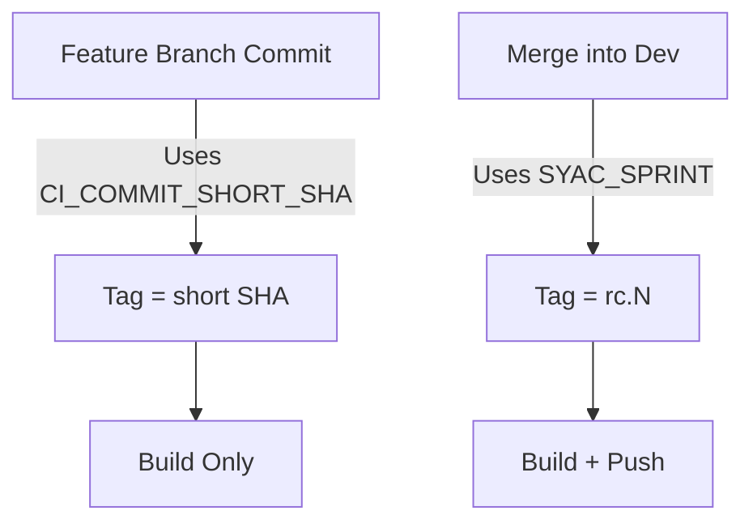

# SYAC - Saved You A Click

SYAC is a GitLab-native build automation tool written in Go. It streamlines the container build and promotion process for microservices deployed via GitLab CI/CD, targeting OpenShift environments.

---

## What It Does

- Reads from GitLab CI environment variables and a `.env` file for local testing.
- Builds and tags Docker images based on:
  - **Feature branches** → uses `CI_COMMIT_SHORT_SHA`
  - **Merge requests into `dev`** → creates **Release Candidate (RC)** tags like `rc.42`
- Pushes images based on derived logic (e.g. skips push for dev unless `SYAC_FORCE_PUSH=true`).
- Supports configuration via environment variables with sane defaults.

---

## 🔧 Project Structure

```plaintext
syac/
├── main.go                     # Entry point for CLI
├── Dockerfile                  # Simple Go build container
├── internal/
│   └── docker/
│       ├── config.go           # Loads and validates environment config
│       ├── builder.go          # Docker build logic
│       ├── runner.go           # Optional CLI helpers
├── test/
│   ├── integration_test.go     # Full-flow integration test using `.env.dev`
│   └── testdata/
│       └── .env.dev            # Sample environment for local testing
└── .env                        # Local override of GitLab CI vars
```


## Future Enhancements

- **Automatic Semantic Version Bumping**  
  Analyze Merge Request comments for version bump hints:
  - `#patch`, `#minor`, or `#major`
  - Apply bump logic accordingly (e.g., 1.2.3 → 1.2.4, 1.3.0, or 2.0.0)

- **Changelog Generation**  
  Generate/update changelogs as part of the tagging process.

- **Multi-registry Promotion**  
  Add support for registry path rewriting or cross-registry mirroring for different environments.

- **Dry Run Support**  
  Add a mode that prints actions without executing them, useful for debugging or verification.